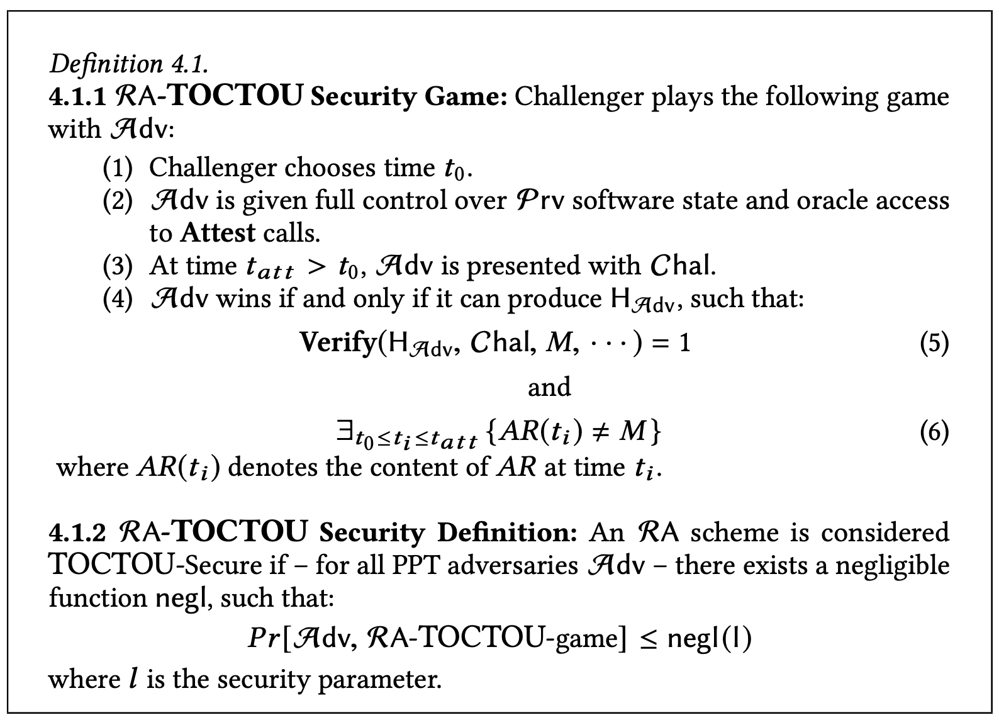
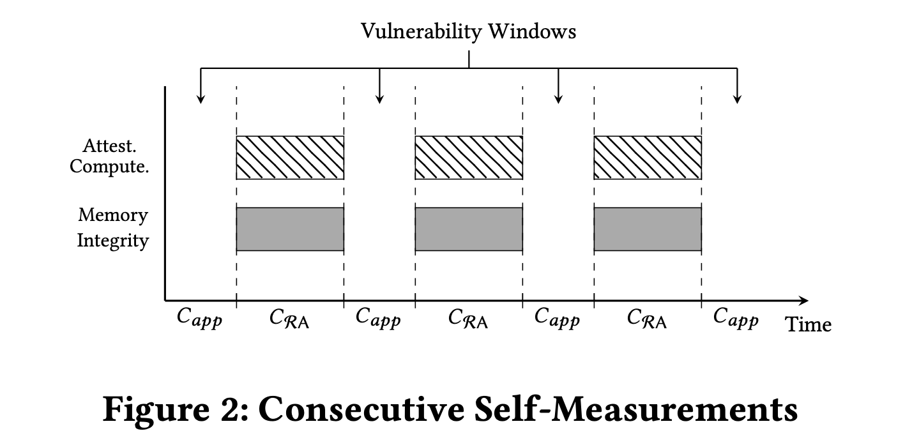
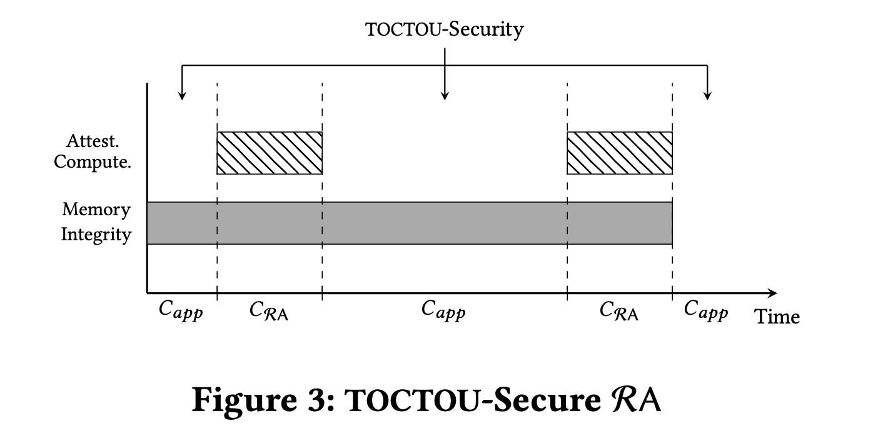
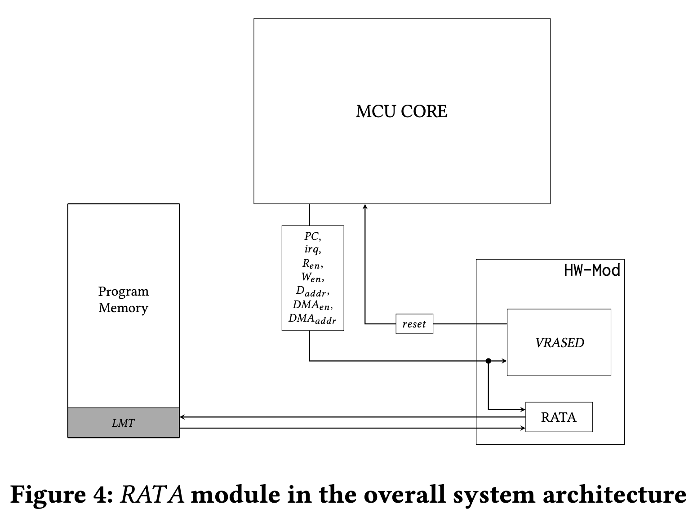
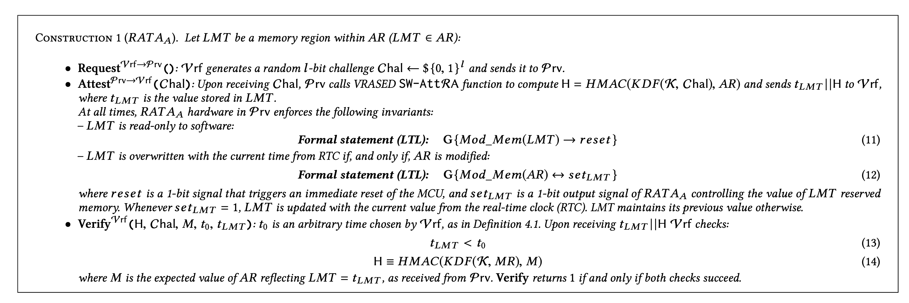
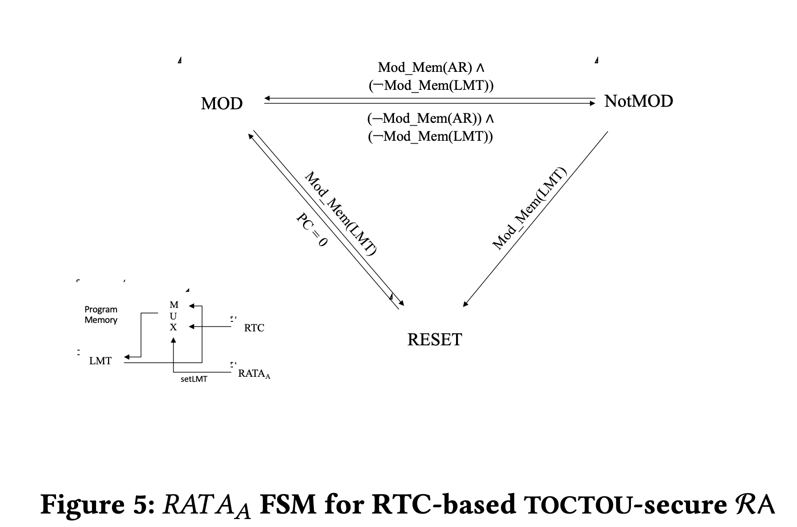
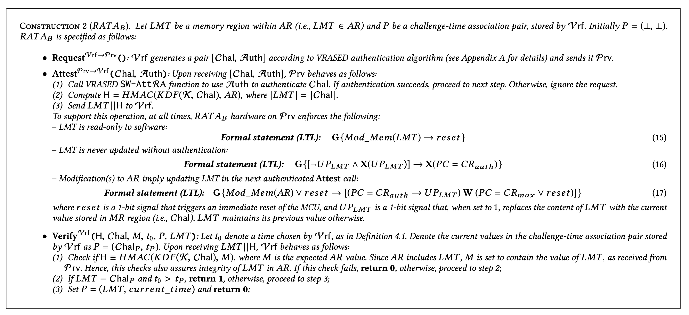
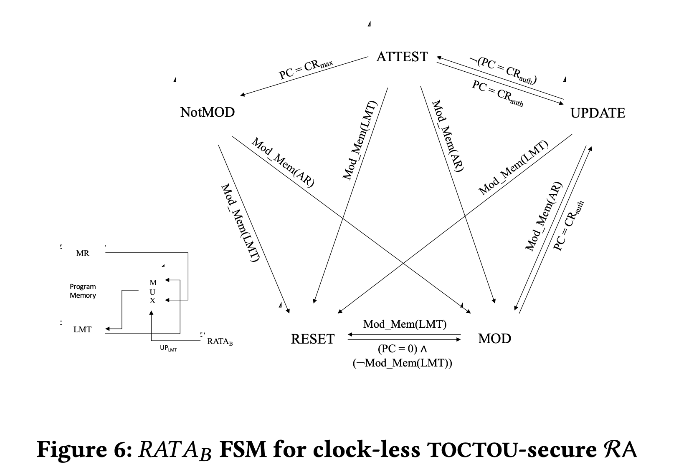

- Resume
	- The paper proposes the use of a hybrid approach to low cost/power devices for the TOCTOU (Time Of Check, Time of Use) attacks. This approach is basically a timestamp/counter for the last time a write operation (modifiication) of the attested region was performed. If the time stamp is different than the one on the verifier the device has been compromised.ç
	- RA serves as a foundation for many security services, such as proofs of memory erasure, system reset, software update, and verification of runtime properties. Prior RA techniques verify the remote device binary at the time when RA functionality is executed, thus providing no information about the device binary before current RA execution or between consecutive RA executions. This implies that presence of transient malware (in the form of modified binary) may be undetected. In other words, if transient malware infects a device (by modifying its binary), performs its nefarious tasks, and erases itself before the next attestation, its temporary presence will not be detected.
	- This important problem, called Time-Of-Check-Time-Of-Use (TOCTOU), is well-known in the research literature and remains unaddressed in the context of hybrid RA.
	- In this work, we propose Remote Attestation with TOCTOU Avoidance (RATA): a provably secure approach to address the RA TOCTOU problem. With RATA, even malware that erases it- self before execution of the next RA, can not hide its ephemeral presence.RATAtargetshybridRAarchitectures,whichareaimedat low-end embedded devices. We present two variants – #RATA_A and #RATA_B – suitable for devices with and without real-time clocks, respectively
		- demonstrates low hardware overhead of both techniques. Compared with current hybrid RA architectures – that offer no TOC- TOU protection – RATA incurs no extra runtime overhead.
- Interesting methods
	- They use a MSP430 RTL to simulate and add custom HW to the device to monitor/control the access entries on the attested region
- This paper is centered around a witness for modifications on the attested regions, meaning this a software attestation and not a CF attestation as the one we want for the thesis
- Device model(signals)
	- A1 – Program Counter (PC): PC always contains the address of the instruction being executed in a given CPU cycle.
	  A2 – Memory Address: Whenever memory is read or written, a data-address signal (Daddr ) contains the address of the correspond- ing memory location. For a read access, a data read-enable bit (Ren) must be set, while, for a write access, a data write-enable bit (Wen) must be set.
	  A3 – DMA: Whenever the Direct Memory Access (DMA) controller attempts to access the main system memory, a DMA-address sig- nal (DMAaddr ) reflects the address of the memory location being accessed and the DMA-enable bit (DMAen) is set. DMA can not access memory without setting DMAen.
	  A4 – MCU Reset: At the end of a successful reset routine, all regis- ters (including PC) are set to zero before resuming normal software execution flow. Resets are handled by the MCU in hardware. Thus, the reset handling routine can not be modified. When a reset hap- pens, the corresponding reset signal is set. The same signal is also set when the MCU initializes for the first time.
- RA TOCTOU
- 
	- Continuous attestation can be a DDOS if the attested region is large and the device clock frequency is low. And it does not solve the TOCTOU attacks as they is a windows for the malicious software to attack
	- 
	- The proposed method of a "timestamp" ensures the integrity of the memory region
	- 
- RATA_A: RTC-BASED TOCTOU-SECURE TECHNIQUE
	- 
	- RATA_A is illustrated in Figure 4; it is designed as a verified hardware module behaving as follows:
	  (1) It monitors a set of CPU signals and detects whenever any location within AR is written. This is achieved by checking the value of signals Daddr , Wen, DMAaddr , and DMAen (see Section 3.2). These signals allow detection of memory modifications either by CPU or DMA.
	  (2) Whenever a modification in AR is detected, RAT AA logs the timestamp by reading the current time from the RTC and storing it in a fixed memory location, called Latest Modification Time (LMT ).
	  (3) In the memory layout, LMT ∈ AR. Also, RATAA enforces that LMT is always read-only for all software executing on the MCU, and for DMA.
	- 
	- 
	- LMT is basically the witness that the attested region hasn't been modified, because if the attacker deletes it self(modifies the memory) the time stamp will be different that the one the verifer has
- RATA_B: CLOCKLESS TOCTOU-SECURE RA TECHNIQUE
	- We apply the ideas from RATA_A by using hard- ware to convey authenticated information about the time of the latest memory modification as part of the attestation result. How- ever, lack of RTC precludes any notion of “time” on Prv. To cope with this, we rely on Vrf to convey information tied to a given point in time, according to Vrf own local clock. This is done as a part of RA Request algorithm. In fact, RATAB uses the attestation challenge (Chal) itself in this task, taking advantage of the fact that Chal is unique per Request and is available in any RA technique, thus incurring no additional communication overhead. Security of RATAB is tightly coupled with authentication of Vrf Request, which is already part of VRASED architecture
	- Attest(Chal, ...). LMT is overwritten with the currently received Chal if and only if, a modification of AR occurred since the previous Attest instance. In summary, RATAB security relies on the follow- ing properties, enforced by its verified hardware implementation (see Section 6.2):
	  (1)SimilartoRATAA,nosoftwarerunningonPrvcanoverwrite LMT , i.e., LMT is only modifiable by RAT AB hardware.
	  (2) An update to LMT is triggered only immediately after a successful authentication during Attest computation.
	  (3) The first successful authentication happening after a modification of AR always causes LMT to be updated with the current value of Chal which is stored in MR. (Recall from Table 1 that MR is the memory location from which Attest reads the value of Chal.)
	- 
	- 
	-
- CONCLUSIONS
	- In this paper, we design, prove security of, and formally verify two designs (RATAA and RATAB) to secure RA against TOCTOU- related attacks, which perform illegal binary modifications on a low-end embedded system, in between successive RA instances. RATAA and RATAB modules are formally specified and verified using a model-checker. They are also composed with VRASED – a verified RA architecture. We show that this composition is TOCTOU- secure using a reduction-based cryptographic proof. Our evaluation demonstrates that a TOCTOU-Secure design is affordable even for cost-sensitive low-end embedded devices. Also, i n most cases, it reduces RA time complexity from linear to constant, in the size of the attested memory.